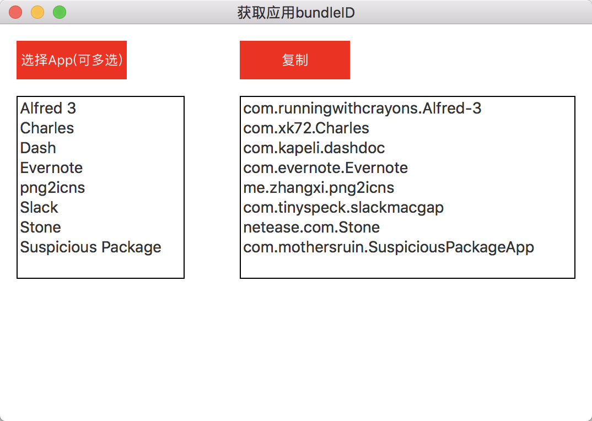
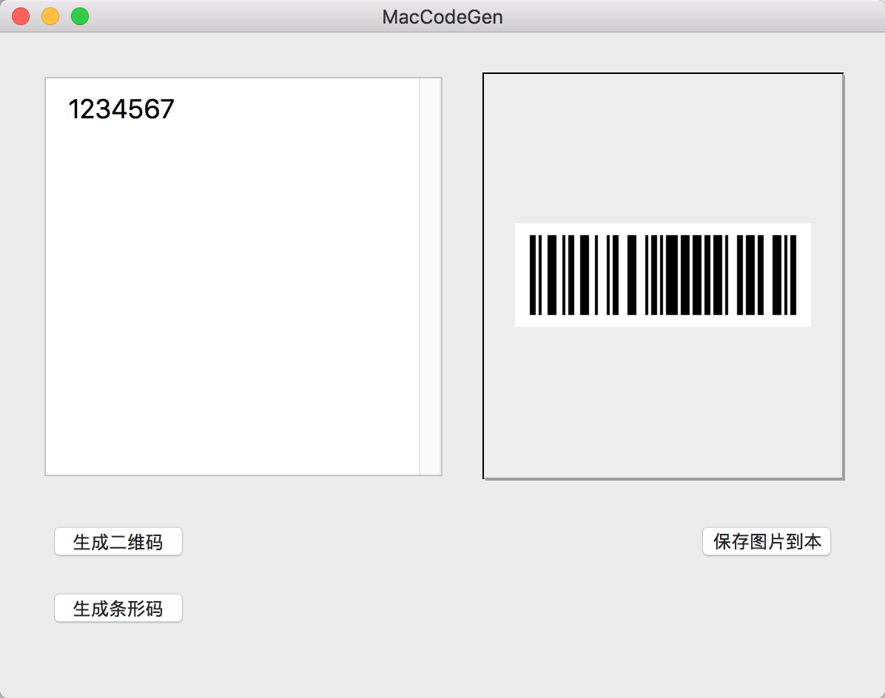

# Mac_Apps

[TOC]

***

# 说明

这里可以贴大家做出来的app，无论大小，有微小价值即可，无需开源；

( 开源项目可以关联到我们组 : MacStorm )

建议每个应用创建一个文件夹，文件夹中放 dmg文件，和描述图片；

然后将描述的图文，在这里说明。

***
# 批量获取bundleID

***

	
	

		<em>A skeleton app showing ModernLook-OSX in action</em>
	

***
# 代码自动生成工具

包含懒加载、coding 协议实现方法

***
# 二维码条形码生成工具

***

